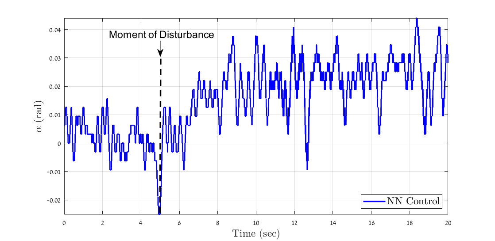

# Data-Driven Control of an Inverted Pendulum System
This is the repository of the paper [ Data-Driven Control of an Inverted Pendulum System](https://www.overleaf.com/project/5fdf0263d2991b9894727c59). 

Yizhak Abu, Tom Hirshberg and Alex M. Bronstein

This notebook present the proposed framework of the paper.

## Define the system  


## Ganerate Data for the referance model
This script Builds an iLQR controller and simulates its input and output in various initial conditions.

```matlab:Code
run DataGen.m
```

## Train the NN-controller and save the best validation results.

```matlab:Code
run FindingNets.m
```

## Stabilty Check
credit : https://github.com/heyinUCB/Stability-Analysis-using-Quadratic-Constraints-for-Systems-with-Neural-Network-Controllers
### Prerequisites
* [CVX](http://cvxr.com/cvx/): Matlab software for convex programming
* [SOSOPT](https://dept.aem.umn.edu/~AerospaceControl/): General SOS optimization utility
* [Multipoly](https://dept.aem.umn.edu/~AerospaceControl/): Package used to represent multivariate polynomials

```matlab:Code
addpath('.\Inverted_Pendulum_control_saturation')
My_Pendulum_sin_local
```
```text:Output
traceP = 252.3150
```


## Experimental system validation
The last state is in Lab, each controller should be tested on a real system for preformance evaluating.:

Response to Unstable Initial Condition , compare to LQR controller:


Robustness to Disturbances:




Robustness to delays:


## License

This project is released under the MIT License. Please review the [License file](LICENSE) for more details.
